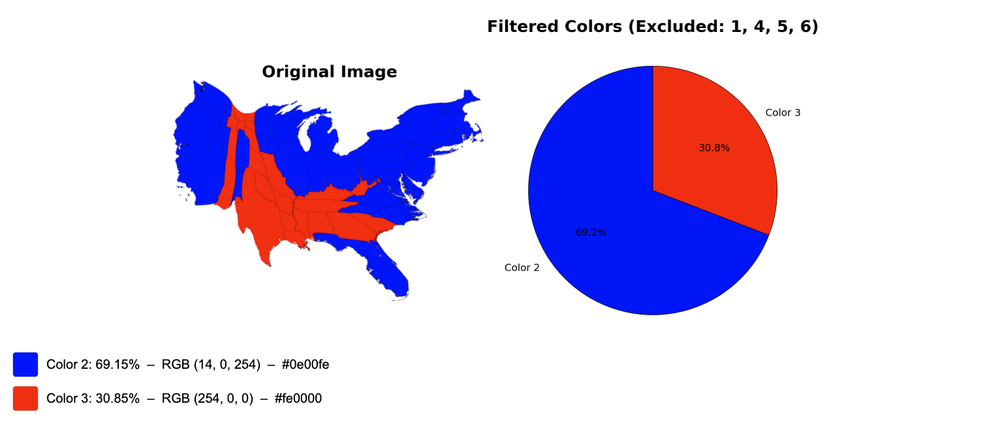

# 🎨 Color Analyzer — Extract Dominant Colors + Filter Interactively

A simple, powerful Flask web application that detects dominant colors in any uploaded image using K-Means clustering.
It displays both the **original image** and a **pie chart of color proportions**, and lets the user **exclude specific colors on the result page** to instantly recalculate percentages.

---

## 🖼 Example Output


The output page displays:

* Original uploaded image
* Pie chart showing filtered color distribution
* Full color list with:

  * Name
  * Percentage
  * RGB tuple
  * HEX code

---

🔗 Live demo: https://colors-in-image-identifier.onrender.com

---

## 🚀 Features

### ✅ Upload any image (PNG, JPG, JPEG)

The app processes the image and extracts pixel-level colors.

### ✅ Advanced color detection

* Uses **KMeans clustering** (20 clusters by default)
* Auto-filters out tiny clusters
* Converts RGB → HEX for clean labeling
* Recalculates percentages after exclusions

### ✅ Interactive color filtering

On the results page, you can:

* Select any color numbers to **exclude**
* Press **Update Exclusions**
* Get a refreshed plot with recalculated percentages
* Values match between printed summary and pie chart

### ✅ Beautiful oversized UI

Designed intentionally large for presentations, demos, and readability.
Both the upload page and results page use a **5× scaled UI**.

### ✅ Pure Flask — no database required

Everything runs locally and securely.
No external APIs.

---

## 📂 Project Structure

```
├── app.py                     # Flask backend
├── uploads/                   # Saved images
├── templates/
│   ├── index.html             # Upload page
│   ├── result.html            # Results page (with exclusion options)
└── requirements.txt           # Dependencies
```

---

## 🧠 How It Works

1. User uploads an image
2. Image is converted into a NumPy array
3. KMeans clustering identifies dominant colors
4. Colors are sorted by percentage
5. User can exclude any color group
6. Percentages are recalculated using remaining pixels
7. A matplotlib figure shows:

   * Original image
   * Filtered color distribution pie chart
8. The plot is sent to the template as a Base64 image
9. Page updates dynamically with new percentages

---

## 📦 Installation

```bash
git clone https://github.com/yourusername/color-analyzer.git
cd color-analyzer
pip install -r requirements.txt
python app.py
```

Then open your browser to:

```
http://127.0.0.1:5000/
```

---

## 🌐 Deployment

This app deploys easily on:

* **Render**
* **Railway**
* **PythonAnywhere**
* **Heroku (via gunicorn)**

Add this to `requirements.txt`:

```
gunicorn
```

And run with:

```
gunicorn app:app
```


## 🧪 Notes

* Works with maps, logos, illustrations, photos, etc.
* Best results occur with high-contrast or color-consistent images.
* Pie chart percentages always match the printed summary.
* UI intentionally oversized for clarity.

---

## 📜 License

MIT License — feel free to use, modify, and build on this project.

---
© 2025 Sofia Mantilla Salas